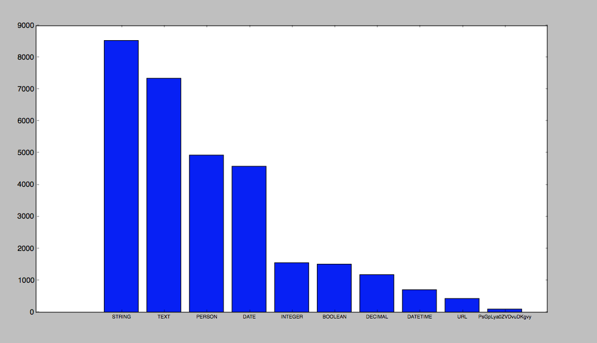

# type_prediction
Predicting the type of a field depending on its display name

The objective of this project is: given a data-set with display names associated with fields and their types, try to predict the type of a field depending on its display name. 
There are 4 files which result from the 4 main stages I had during this project.  
1 DataSet.py 
This file defines a new object called DataSet which enables us to extract data from a csv, clean this data according to what we want to do with it and plot some indicators which will help us driving our timeline.  
I used it in order to clean the data set, ploted the 10 most common types. This made me realise that the types "Folder" and "Tags" were overused and we finally decided not to take them into account for the predictions. Better still, ploting the data also showed that a lot of custom types were used but each one only a few times. These types being registered directly by the customer, we decided not to take them into account as we couldn't predict what doesn't already exist.  
This is why, we finally we decided to deal with these types: ['STRING', 'TEXT', 'PERSON', 'DATE', 'INTEGER', 'BOOLEAN', 'DECIMAL', 'DATETIME', 'URL'], giving us a 24,000 rows data set after all clearings.  
Here are the 10 most common types having cleared "Tags" and "Folder":

 
2 vectorization_Doc2Vec.py  
zfhljgzkqlsch
dsqclhjzd

